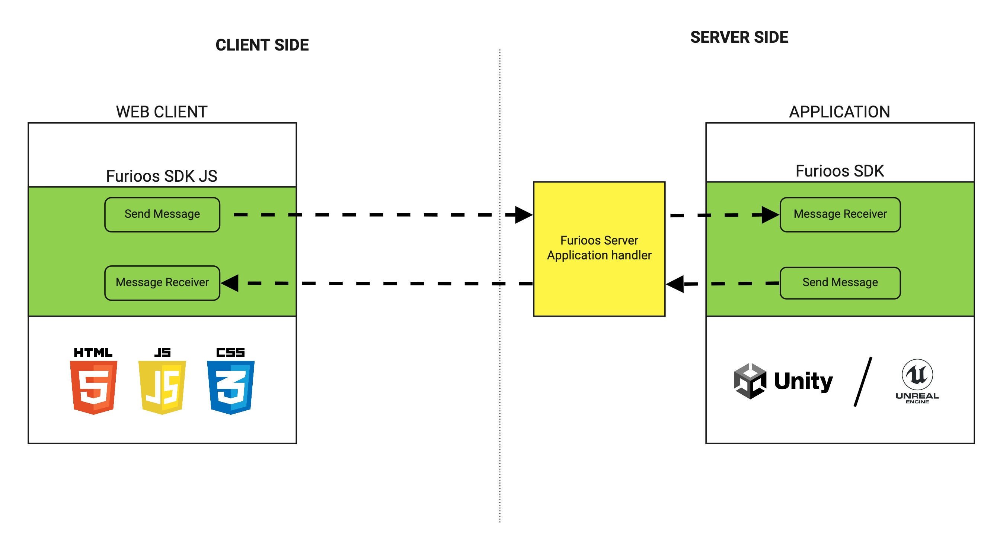
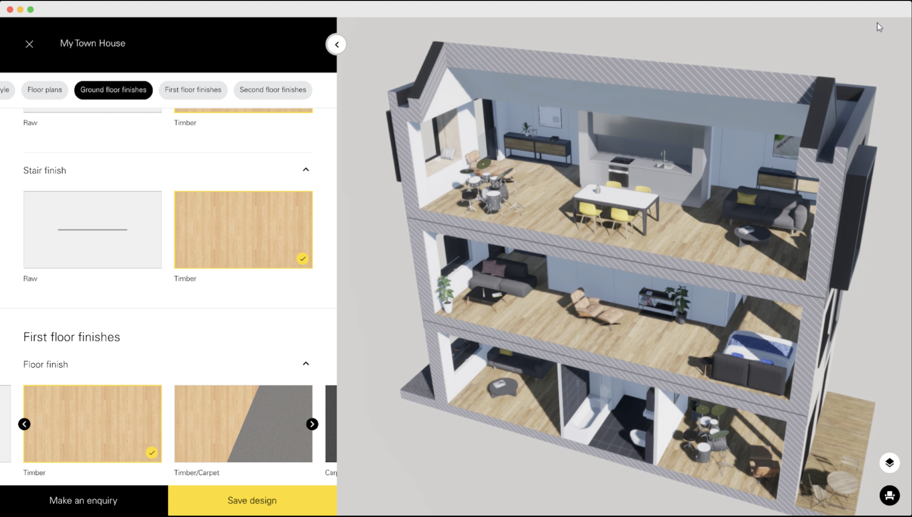
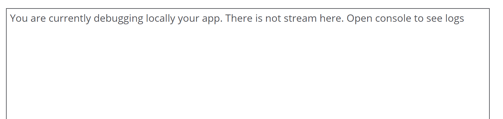

# Furioos SDK JS
> :warning: if you are using the first version of the SDK, please refer to this documentation: [Furioos SDK V1](/READMEV1.md)<br/>
## Requirements
- A Furioos Account on www.furioos.com.
- Then choose the application you want to use with the SDK and create a SDK link.

## Table of contents
* [About Furioos SDK](#about-furioos-sdk)
  * [Why cutomize my furioos player](#why-cutomize-your-furioos-player)
  * [Communicate between my website and my application](#communicate-between-my-website-and-my-application) 
  * [Example of application](#example-of-application)
* [Installation](#installation)
  * [Via NPM](#Via-NPM)
  * [Via CDN](#Via-CDN)
* [API](#api)
  * [Properties](#properties)
  * [Methods](#methods)
  * [Events](#events)
  * [Communicate with your application](#communicate-with-your-application)
* [Debug localy the SDK communication tunnel](#debug-localy-the-sdk-communication-tunnel)
* [Furioos SDK V1](/READMEV1.md)

## About Furioos SDK
The Furioos SDK is composed of 2 parts:
- one is on the website side
- and the other one is on the application side

On the website side you have to use the Furioos SDK JS.
It allows you to :
- embed the Furioos player into your website and customize it
- communicate with your Unity or Unreal application 

### Why cutomize your Furioos player
Here are some possible use cases for player customization (it's not an exhaustive list):
- remove all Furioos branding
- hide the play button   
- hide the player toolbar and build a new one from your website
- create your own installation progress bar
- trigger your own features once the stream has been started
- ...

> ***Note**: For these examples you just need to have the Furioos SDK JS in your website.*


### Communication inbetween my website and my application
However, if you need to communication inbetween your website and your Unity or Unreal application, you will need to add the Furioos SDK (Unity or Unreal) into your application.
This allows you to send and receive bidirectional messages.



> ***Important**: Before sending or receiving messages, the session must be launched. You can check it with ON_APP_START event*

Here are some examples:
- If you want to change the color of an object from your website, you can:
  - Send a message with the final color from your website
  - From your application, get the color in the message and assign the material with the new color
- If you want to get the position of the player to display it on your website
  - Send a message with player coord from the application
  - From your website, get the coordinates and show it on your website

To implement a bidirectionnal communication you can find details below:
- About [Furioos SDK for Unity](https://github.com/Unity-Technologies/furioos-sdk-unity)
- About [Furioos SDK for Unreal](https://github.com/Unity-Technologies/furioos-sdk-unreal-engine)

### Example of application
Here is an example of an application that customizes the Furioos player and uses the message system for a complete integration with the website.\
On the left, the menu is on the website side (html).\
On the right, the house dispay is on the application side (Furious player). 



## Installation
### Via NPM
```bash
npm install --save furioos-sdk
```
or
```bash
yarn add furioos-sdk
```

You can find a full example [HERE](/examples/furioos-sdk-js-npm-example)

### Via CDN
```bash
<script src="https://cdn.jsdelivr.net/gh/Unity-Technologies/furioos-sdk-js@master/dist/furioos.bundle.js"></script>
```

You can find a full example [HERE](/examples/furioos-sdk-js-cdn-example)

## API
#### constructor(sdkShareLinkID, containerDivId, options)
Instanciate the player for a given application.
| Property | Type | Description | optional | DefaultValue |
| --- | --- | --- | --- | --- |
| **`sdkShareLinkID`** | String | Furioos SDK Link ID of the application you want to share. | false | null |
| **`containerDivId`** | String | The ID of the HTML container div that will host the render. | false | null |
| **`options`** | Object | The options to setup the player are these following : | true | {} |

##### options:
| Property | Type | Description | optional | DefaultValue |
| --- | --- | --- | --- | --- |
| **`whiteLabel`** | Boolean | Remove all Furioos' Logo | true | false |
| **`hideToolbar`** | Boolean | Hide the toolbar to create your own | true | false |
| **`hideTitle`** | Boolean | Hide the title bar to create your own | true | false |
| **`hidePlayButton`** | Boolean | Hide the play button | true | false |
| **`debugAppMode`** | Boolean | Active local debug of your application. See [Debug localy the SDK communication tunnel](#debug-localy-the-sdk-communication-tunnel) for more detail | true | false |
| **`inactiveTimeout`** | Number | Defines the inactivity time in a session before it closes (in ms) Min: 10s / Max: 24h | true | 60000 (ms) |


### Basic Example

```javascript
import { Player, FS_SDK_EVENTS_NAME } from 'furioos-sdk';

const options = {
  whiteLabel: true,
  hideToolbar: false,
  hideTitle: true,
  hidePlayButton: false,
  inactiveTimeout: 60000,
};

const player = new Player("YOUR_SDK_LINK_ID" ,"containerDivId", options);

// Bind player loaded
player.on(FS_SDK_EVENTS_NAME.LOAD, function() {
  console.log("SDK client FIRED: Player loaded");
});

// Bind application install progress
player.on(FS_SDK_EVENTS_NAME.ON_APP_INSTALL_PROGRESS, function(data) {
  console.log("SDK client FIRED: App install progress", data);
});

// Bind application start
player.on(FS_SDK_EVENTS_NAME.ON_APP_START, function() {
  console.log("SDK client FIRED: App start");
});

// Bind stream start
player.on(FS_SDK_EVENTS_NAME.ON_STREAM_START, function() {
  console.log("SDK client FIRED: Stream start");
});

// Bind SDK messages
player.on(FS_SDK_EVENTS_NAME.ON_SDK_MESSAGE, function(data) {
  console.log("SDK Message Received:", data);
});

// Bind an event that lets you know if you can resume session
player.on(FS_SDK_EVENTS_NAME.ON_RESUME_SESSION, function({ canResumeSession }) {
  if(canResumeSession) {
    player.resumeSession();
  }
});

// Bind session stoppeds
player.on(FS_SDK_EVENTS_NAME.ON_SESSION_STOPPED, function() {
  console.log("SDK client FIRED: Session Stopped");
});

```

## Properties
>***important** These properties are only getters*
#### quality: String
Get the current setted quality. Possible values : AUTO / LOW / MEDIUM / HIGH

#### volume: Number
Get the current setted volume. Value between 0 - 1

## Methods
<details>
  <summary>
    <b>setThumbnailUrl(url)</b> 
    <p>Change the thumbnail of your app.</p>
  </summary>
  
  | Property | Type | Description | DefaultValue |
  | --- | --- | --- | --- |
  | **`url`** | String | A public url of the thumbnail you want to set | null |
</details>

<details>
  <summary>
    <b>getServerAvailability(function(data) {}, function(error) {})</b> 
    <p>Call this function to get an estimated time to get a session on Furioos.</p>
  </summary>
  
  <b>data:</b>
  | Property | Type | Description | DefaultValue |
  | --- | --- | --- | --- |
  | **`assignTime`** | Number | Estimated time (minutes) to be assigned to a server | 0 |
  | **`launchTime`** | Number | Estimated time (minutes) for your app to be ready (copied, extracted and launched) | 0 |
  | **`availableMachines`** | Number | Number of ready VM waiting for a session | 0 |
  | <b>*</b>**`maximumMachines`** | Number | Maximum machines setted on your campaign | 0 |
  | <b>*</b>**`usedMachines`** | Number | Number of current used machines in your pool | 0 |
  | <b>*</b>**`creatingMachines`** | Number | Number of creating machines (creating machine in the cloud) | 0 |
  | <b>*</b>**`installingMachines`** | Number | Number of installing machine (installing your application on it) | 0 |
  
  <b>*</b> *Those values are only available for an application running on a pre-allocated campaign.*
  
  <b>Example:</b>

  ```javascript
    player.getServerAvailability(function(data) {
      console.log("Time to assign a server: ", data.assignTime);
      console.log("Time to copy, extract and launch your application: ", data.launchTime);
      console.log("Number of machines ready for a session: ", data.availableMachines);
      console.log("Total time to get session ready: ", data.assignTime + data.launchTime);
    }, function(error) {
      // Treat the error.
    });
  ```
</details>

<details>
  <summary>
    <b>getServerMetadata(function(metadata) {}, function(error) {})</b> 
    <p>
      Call this function to get unique VM informations.
      This function returns metadata only if a session is running.
    </p>
  </summary>
  
  <b>metadata:</b>
  | Property | Type | Description | DefaultValue |
  | --- | --- | --- | --- |
  | **`publicIP`** | String | The VM public IP. | "" |
  | **`name`** | String | A unique name to identify a VM. | "" |
  
  <b>Example:</b>
  ```javascript
    player.getServerMetadata(function(metadata) {
      console.log("Public VM IP: ", metadata.publicIP);
      console.log("VM unique name: ", metadata.name);
    }, function(error) {
      // Treat the error.
    });
  ```
</details>

<details>
  <summary>
    <b>start(location)</b> 
    <p>
      Start a new session.
    </p>
  </summary>
  
  | Property | Type | Description | DefaultValue | Optional |
  | --- | --- | --- | --- | --- |
  | **`location`** | String | The VM public IP. | "" | true |
  
  <b>Example:</b>
  ```javascript
    player.start(Player.regions.EUW);
  ```
</details>

#### **stop()**
Stop the session.

#### **maximize()**
Enable Full screen mode.

##### **minimize()**
Disable Full screen mode.

<details>
  <summary>
    <b>setQuality(quality)</b> 
    <p>
      Set the quality of the stream.<br/>
      Use the new quality values by importing FS_QUALITY_VALUES<br/>
      :warning: You can access deprecated quality values by importing QUALITY_VALUES. However these value are no longer available.
    </p>
  </summary>
  
  | Property | Type | Description | DefaultValue | Optional |
  | --- | --- | --- | --- | --- |
  | **`quality`** | QualityValue | Use one of the static value FS_QUALITY_VALUES.AUTO / FS_QUALITY_VALUES.LOW / FS_QUALITY_VALUES.MEDIUM / FS_QUALITY_VALUES.HIGH | Furioos App Quality | false |
  
  <b>Example:</b>
  ```javascript
    player.setQuality(FS_QUALITY_VALUES.HIGH);
  ```
</details>

#### **restartStream()**
Restart the streaming.

#### **resumeSession()**
Resume active session. You can only call this method after check the response value of ON_RESUME_SESSION event

<details>
  <summary>
    <b>setVolume(volume)</b> 
    <p>
      Set the volume of the stream.
    </p>
  </summary>
  
  | Property | Type | Description | DefaultValue | Optional |
  | --- | --- | --- | --- | --- |
  | **`volume`** | Number | Volume intensity between 0 - 1 | 1 | false |
  
  <b>Example:</b>
  ```javascript
    player.setVolume(0.5);
  ```
</details>


#### **setUserActive()**
This function helps you to keep the session opened if your user does not interact with the interface.  
Calling this function will fire onUserActive.  
> :warning: ***important**: We recommended to use inactiveTimeout in Player constructor instead of calling this function. If you always call it without checking if the user is really here the session will never end untill the user close their window.*

## Events
#### **.on(FS_SDK_EVENTS_NAME, callback)**
To be able to bind player events, you just need to call the .on function and give it an SDK events parameter and a callback to get the infos. All FS_SDK_EVENTS_NAME constants are accessible from the furioos-sdk package.

<details>
  <summary>
    <b>LOAD</b> 
    <p>
      Bind a callback that will be called when the player is ready.
    </p>
  </summary>

  <b>Example</b>
  ```javascript
  player.on(FS_SDK_EVENTS_NAME.LOAD, function(data) {
     // Here you know when the player is ready.
      console.log("SDK client FIRED: Player loaded");
  })
  ```
</details>

<details>
  <summary>
    <b>ON_APP_INSTALL_PROGRESS</b> 
    <p>
       Bind a callback that will be called during your application installation.
       You'll receive the progress of the installation.
    </p>
  </summary>
  
  <b>data: </b>
  | Property | Type | Description | Value |
  | --- | --- | --- | --- |
  | **`status`** | String | The current installation step | "COPY" or "UNARCHIVE" |
  | **`progress`** | Number | The progress value | between 0 and 1 |

  <b>Example</b>
  ```javascript
  player.on(FS_SDK_EVENTS_NAME.ON_APP_INSTALL_PROGRESS, function(data) {
    // Implement your own code.
    console.log(data.status + " the application : " + Math.round(data.progress*100) + "%");
  })
  ```
</details>

<details>
  <summary>
    <b>ON_APP_INSTALL_SUCCESS</b> 
    <p>
       Bind a callback that will be called when your application installation has succeed.
    </p>
  </summary>
  
  <b>Example</b>
  ```javascript
  player.on(FS_SDK_EVENTS_NAME.ON_APP_INSTALL_SUCCESS, function() {
    // Implement your own code.
    console.log("My application is fully installed");
  })
  ```
</details>

<details>
  <summary>
    <b>ON_APP_INSTALL_FAIL</b> 
    <p>
       Bind a callback that will be called when your application installation has failed.
    </p>
  </summary>
  
  <b>Example</b>
  ```javascript
  player.on(FS_SDK_EVENTS_NAME.ON_APP_INSTALL_FAIL, function() {
    // Implement your own code.
    console.log("Installation has failed");
  })
  ```
</details>

<details>
  <summary>
    <b>ON_APP_START</b> 
    <p>
       Bind a callback that will be called when your application starts.
    </p>
  </summary>
  
  <b>Example</b>
  ```javascript
  player.on(FS_SDK_EVENTS_NAME.ON_APP_START, function() {
    // Implement your own code.
    console.log("Application started");
  })
  ```
</details>

<details>
  <summary>
    <b>ON_STREAM_START</b> 
    <p>
       Bind a callback that will be called when the stream starts.
    </p>
  </summary>
  
  <b>Example</b>
  ```javascript
  player.on(FS_SDK_EVENTS_NAME.ON_STREAM_START, function() {
    // Implement your own code.
    console.log("Stream started");
  })
  ```
</details>

<details>
  <summary>
    <b>ON_USER_ACTIVE</b> 
    <p>Bind a callback that will be called when the user is **active** on your session (only fired when a session is running).</p>
  </summary>

<b>Example</b>
```javascript
player.on(FS_SDK_EVENTS_NAME.ON_USER_ACTIVE, function() {
  // Implement your own code.
  console.log("My user is active");
})
```
</details>

<details>
  <summary>
    <b>ON_USER_INACTIVE</b> 
    <p>Bind a callback that will be called when the user is **inactive** on your session (only fired when a session is running).</p>
  </summary>

<b>Example</b>
```javascript
player.on(FS_SDK_EVENTS_NAME.ON_USER_INACTIVE, function() {
  // Implement your own code.
  console.log("My user is inactive");
})
```
</details>

<details>
  <summary>
    <b>ON_SESSION_STOPPED</b> 
    <p>Bind a callback that will be called when the session is stopped (ex: stopped for inactivity).</p>
  </summary>

<b>Example</b>
```javascript
player.on(FS_SDK_EVENTS_NAME.ON_SESSION_STOPPED, function() {
  // Implement your own code.
  console.log("The session has been stopped");
})
```
</details>

<details>
  <summary>
    <b>ON_STATS</b> 
    <p>Bind a callback that will be called frequently during a running session with all stats.</p>
  </summary>
  
  <b>stats:</b>
  | Property | Type | Description | DefaultValue |
  | --- | --- | --- | --- |
  | **`appHeight`** | Number | Height of the application screen on VM | 0 |
  | **`appWidth`** | Number | Width of the application screen on VM | 0 |
  | **`dataLatency`** | Number | Round trip network latency | 0 |
  | **`dataMethod`** | String | events/data transmission method (value: "datachannel" or "ws") | "datachannel" |
  | **`packetsLost`** | Number | Percent of lost packets (value: 0 to 1) | 0 |
  | **`serverCpuUsage`** | Number | Server CPU usage | 0 |
  | **`serverEncodingMs`** | Number | Server encoding time (milliseconds) | 0 |
  | **`serverFramerate`** | Number | Server framerate | 0 |
  | **`serverGpuMemTotal`** | Number | Total GPU RAM available on server (byte) | 0 |
  | **`serverGpuMemUsed`** | Number | Current GPU RAM used on server (byte) | 0 |
  | **`serverGpuUsage`** | Number | Server GPU usage percent | 0 |
  | **`serverGrabbingMs`** | Number | Server grabbing time (milliseconds) | 0 |
  | **`serverRamTotal`** | Number | Total RAM available on serve (byte) | 0 |
  | **`serverRamUsed`** | Number | Current RAM used on server (byte) | 0 |
  | **`streamingEngine`** | String | Current streaming engine used (value: "Furioos" or "RenderStreaming") | "Furioos" |
  | **`userActive`** | Boolean | Define if the user is consider as active by the Furioos player | 0 |
  | **`videoBitrate`** | Number | Received video bitrate (kbps) | 0 |
  | **`videoFramerate`** | Number | Received video framerate | 0 |
  | **`videoHeight`** | Number | Heigh of the received video | 0 |
  | **`videoWidth`** | Number | Width of the received video | 0 |
  | **`videoLatency`** | Number | Total video latency (round trip network latency + decoding time) | 0 |


  <b>Example</b>
  ```javascript
  player.on(FS_SDK_EVENTS_NAME.ON_STATS, function(stats) {
    // Implement your own code.
    console.log("Stats received: ", stats);
  })
  ```
</details>

<details>
  <summary>
    <b>ON_SDK_MESSAGE</b> 
    <p>
       Bind a callback that will be called while your application is sending you data.
       Data can be a String or an Object.
    </p>
  </summary>

  <b>Example</b>
  ```javascript
  player.on(FS_SDK_EVENTS_NAME.ON_SDK_MESSAGE, function(data) {
    // Implement your own code.
    console.log("The application sent: " + data);
  })
  ```
</details>

<details>
  <summary>
    <b>ON_CRASH_APP</b> 
    <p>
       Bind a callback that will be called when your application crashes.
    </p>
  </summary>

  <b>Example</b>
  ```javascript
  player.on(FS_SDK_EVENTS_NAME.ON_CRASH_APP, function() {
    // Implement your own code.
    console.log("The application crashed");
  })
  ```
</details>

<details>
  <summary>
    <b>ON_RESUME_SESSION</b> 
    <p>
      Bind a callback that will be called when the player is initialized.
      It Lets you know if you can restart a session in progress.
    </p>
  </summary>

  <b>data: </b>
  | Property | Type | Description | Value |
  | --- | --- | --- | --- |
  | **`canResumeSession`** | Boolean | Define if you can resume a session or not | |

  <b>Example</b>
  ```javascript
  player.on(FS_SDK_EVENTS_NAME.ON_RESUME_SESSION, function(data) {
    // Implement your own code.
    if(data.canResumeSession) {
      player.resumeSession();
    }
    console.log("Can resume sesssion: " + data.canResumeSession);
  })
  ```
</details>

## Communicate with your application
Go deeper with your UI by creating your own data interpretation.  
Those methods let you send/receive JSON data inbetween your application and the HTML page where you have implemented the JS SDK.

#### Requirements
- The Furioos SDK implemented in your application.
  - Furioos SDK for Unity : https://github.com/Unity-Technologies/furioos-sdk-unity
  - Furioos SDK for Unreal : https://github.com/Unity-Technologies/furioos-sdk-unreal-engine

<details>
  <summary>
    <b>.on(FS_SDK_EVENTS_NAME.ON_SDK_MESSAGE, function(data) {})</b> 
    <p>
      Bind a callback to receive messages from your application.
    </p>
  </summary>
  
  | Property | Type | Description | DefaultValue | Optional |
  | --- | --- | --- | --- | --- |
  | **`data`** | Object | The JSON that you send from your application. | null | false |
  
  <b>Example:</b>
  ```javascript
    player.on(FS_SDK_EVENTS_NAME.ON_SDK_MESSAGE, function(data) {
      console.log("Message received from my application: ", data);
    });
  ```
</details>

<details>
  <summary>
    <b>sendSDKMessage(data)</b> 
    <p>
      Send data to your own application by using the Furioos SDK.
    </p>
  </summary>
  
  | Property | Type | Description | DefaultValue | Optional |
  | --- | --- | --- | --- | --- |
  | **`data`** | Object | The data you want to send to your app formated in JSON. | null | false |
  
  <b>Example:</b>
  ```javascript
    player.sendSDKMessage({ "test": "test" }); 
  ```
</details>

## Examples of implementation


## Debug localy the SDK communication tunnel
The Furioos SDK Unity provides a local debug mode, to facilitate the debugging of sending and receiving messages.

> ***Note**: There will be no stream.*

> This feature opens a direct tunnel inbetween your website and your application running locally.\
Only <b>sendSDKMessage</b> and <b>onSDKMessage</b> can be used here to test the communication.


### How does it work ?
#### Webclient Side

To enable debugging mode you have to set the **debugAppMode** property to true.

```javascript
import { Player } from 'furioos-sdk';

const options = {
  whiteLabel: true,
  hideToolbar: false,
  hideTitle: true,
  hidePlayButton: false,
  debugAppMode: true, // This enable the local debug mode.
};

const player = new Player("YOUR_SDK_LINK_ID", "containerDivId", options);
```
When you launch your site in debug mode, the stream is not displayed, the following message will appear on your player.




#### Unity Side

Nothing to configure. When you start your application(With last version of the Furioos SDK Unity) with the play button in the Unity Editor, the local debug mode is automatically enabled.

#### Unreal Engine Side

For the moment, it is not possible activate the debug mode. The new version of the Furioos SDK for Unreal is coming soon.

## :warning: Common Errors

- *Failed to execute 'postMessage' on 'DOMWindow': The target origin (http://....) provided does not match the recipient window's origin ('http://...')*

  This error means that you do not have the correct website URL set on your SDK link, on Furioos side.  
Your player’s implementation url must match the website URL entered when creating your SDK link on the Furioos side. 
If you’re working locally, remind that you might need to change the URL on the SDK Link, example: http://localhost:8080. 